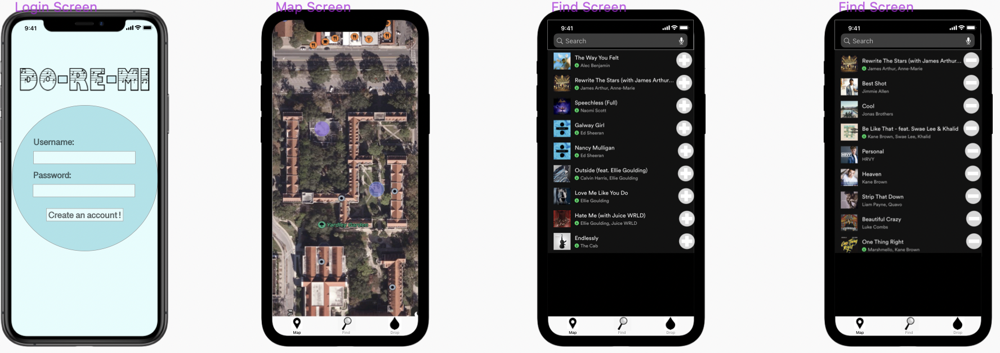

# Do-Re-Mi
Unit 8: Group Milestone 
===

# Do-Re-Me

## Table of Contents
1. [Overview](#Overview)
2. [Product Spec](#Product-Spec)
3. [Wireframes](#Wireframes)

## Overview
### Description
Do-Re-Mi is a music app that allows people to discover new music based on location. Users can "drop" music at their location, and when other users walk by, they can add the song to their queue!

### App Evaluation
- **Category:** Social Networking / Music
- **Mobile:** This app would be primarily developed for mobile. Since users must get music based on their location, it will be impractical to develop features for a web application.
- **Story:** A user walks by a mall, and decides to drop their music at that location using Do-Re-Me. Their song is discoverable by other users for a few hours. Other users at the mall can add the song to their queue and listen to it.
- **Market:** Any individual could choose to use this app. It will likely see higher usage in population-dense places, such as a mall or a college-campus.
- **Habit:** This app could be used as often as users want. We believe users who walk, jog, or run past specific places may use this app often. Also,those who want to discover music can simply walk to a specific location and discover the music that people want to share.
- **Scope:** First, we will start with developing the feature to "drop" music at the user's current location. Then, we must ensure that the song can persist in that location for a few hours and is visible to all other users nearby. Then, we will develop the feature to add the specific song to a queue. Initially, we will use the Spotify API, but there is a large potential for use with multiple streaming service applications, such as YouTube, Apple Music, and Soundcloud. Furthermore, there is potential to develop a social networking and messaging feature, where users can view other users' profile and view the most current songs they've "dropped".

## Product Spec
### 1. User Stories (Required and Optional)

**Required Must-have Stories**

* User logs in to access previous chats and preference settings
* User picks what their favorite artist/genre/etc. (Think Spotify interface)
* Matches have a chat window to get to know each other, with the ability to skip music and unmatch (Tinder Style).
* Profile pages for each user
* Settings (Accesibility, Notification, General, etc.)

**Optional Nice-to-have Stories**

* Log of past songs/people with album art covers matching
* Page of most played songs (i.e. songs that most users are connecting through)
* Profile Add-On: Top music choices, etc.
* Optional Shuffle Button (i.e. random encounter/random song)
* Listening/Encounter Queue

### 2. Screen Archetypes

* Login 
* Register - User signs up or logs into their account
   * Upon Download/Reopening of the application, the user is prompted to log in to gain access to their profile information to be properly matched with another person. 
   * ...
* Messaging Screen - Chat for users to communicate (direct 1-on-1)
   * Upon selecting music choice users matched and message screen opens
* Profile Screen 
   * Allows user to upload a photo and fill in information that is interesting to them and others
* Song Selection Screen.
   * Allows user to be able to choose their desired song, artist, genre of preference and begin listening and interacting with others.
* Settings Screen
   * Lets people change language, and app notification settings.

### 3. Navigation

**Tab Navigation** (Tab to Screen)

* Music selection
* Profile
* Settings

Optional:
* Music/Encounter Queue
* Discover (Top Choices)

**Flow Navigation** (Screen to Screen)
* Forced Log-in -> Account creation if no log in is available
* Music Selection (Or Queue if Optional) -> Jumps to Chat
* Profile -> Text field to be modified. 
* Settings -> Toggle settings

## Wireframes

